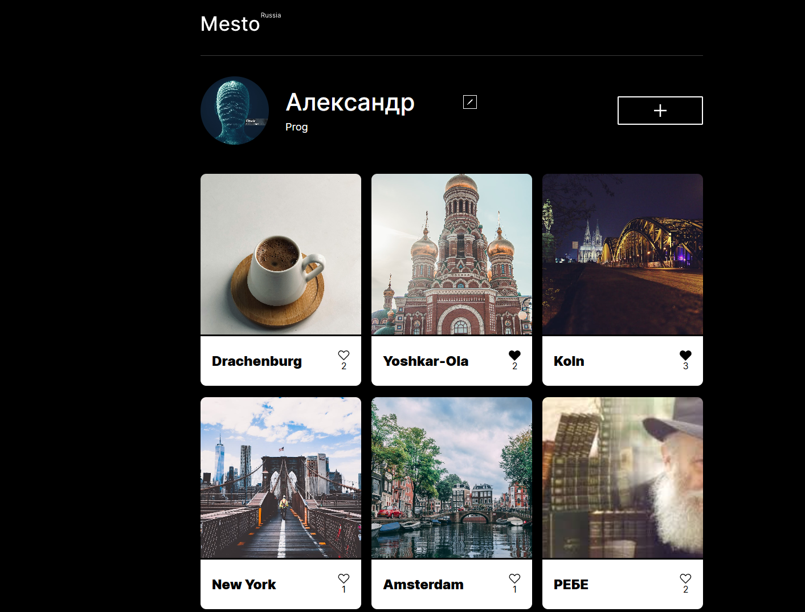

# Проектная работа Mesto(Классический JS API)

## Функционал
1. Создание и публикация карточек на странице
2. Удаление и лайк карточек, модульность кода
3. Модальные окна, добавление новой карточки по URL, изменение информации профиля, закрытие модальных окон
4. Изменение аватара профиля
5. ВалидациЯ форм
6. Интеграция с API: рендер и удаление карточек, лайки, инфо профиля

### Инструкция по запуску
- Создайте папку для проекта и перейдите в неё.
- Склонируйте репозиторий `git clone git@github.com:AplusO1/mesto-project-ff.git`
- Установите зависимости `npm install`
- Запускайте проект `npm run dev`
---